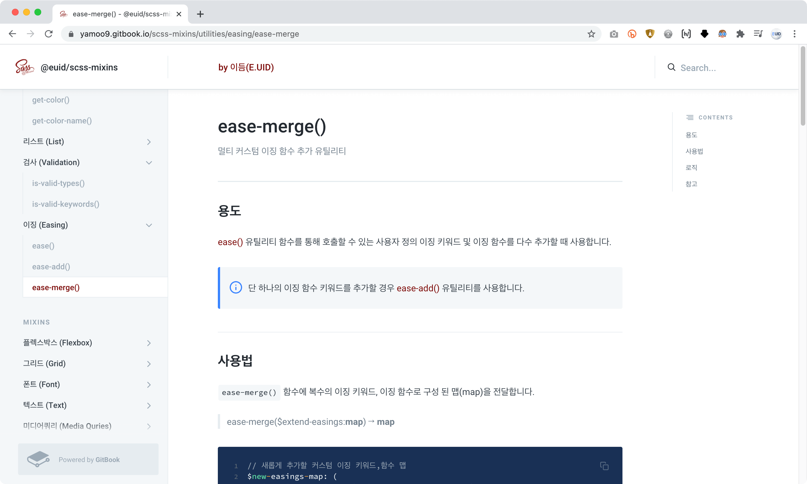

# 이듬(E.UID) — SCSS Mixins

    <br/>

<!-- 
     
-->

SCSS 믹스인 라이브러리 → [이듬(E.UID)](https://euid.dev) 블렌디드 러닝 학습용


<br/>

## 패키지 설치 (Install)

`@euid/scss-mixins` 패키지를 설치하는 방법은 다음의 2가지 중 하나를 선택해 사용할 수 있습니다.

**방법 1. [NPM](https://npmjs.com) 명령을 사용해 [@euid/scss-mixins](https://www.npmjs.com/package/@euid/scss-mixins) 패키지 설치 (권장)**

```sh
$ npm i @euid/scss-mixins
```

**방법 2. GitHub [yamoo9/scss-mixins](https://github.com/yamoo9/scss-mixins) 저장소 복제**

```sh
$ git clone https://github.com/yamoo9/scss-mixins.git
```

<br/>

## 패키지 호출 (Import)

@euid/scss-mixins 패키지를 사용하는 방법은 다음과 같습니다.

**방법 1. 상대 경로 활용**

별도 설정 없이 패키지를 호출해 사용할 경우, 상대 경로 방식으로 @euid/scss-mixins 패키지를 찾습니다.

```scss
@import '../node_modules/@euid/scss-mixins';
```

**방법 2. 임포트 경로(load path) 설정 (권장)**

[Dart Sass CLI](https://sass-lang.com/documentation/cli/dart-sass) 명령을 사용해 `node_modules` 디렉토리의 패키지를 불러올 수 있도록 설정합니다.

```sh
$ sass -I node_modules src/sass:dist/css
```

컴파일 명령을 실행할 때, 전달하는 `-I`는 `--load-path` 옵션의 단축 옵션입니다.  
단축 옵션을 사용하지 않을 경우 다음과 같이 명령문을 작성해 실행할 수 있습니다.

```sh
# -I, --load-path=
$ sass --load-path=node_modules src/sass:dist/css
```

패키지에서 모든 믹스인을 가져와 사용하려면 다음과 같이 호출 코드를 작성합니다.

```scss
@import '@euid/scss-mixins';
```

<br/>

## 패키지 문서 (Documentation)

[@euid/scss-mixins 문서](https://yamoo9.gitbook.io/scss-mixins)를 통해 사용법을 확인하고 익힐 수 있습니다.



<br/>

## VS Code 확장(Extension)

[@euid/scss-mixins 스니펫(Snippets)](https://marketplace.visualstudio.com/items?itemName=yamoo9.euid-scss-mixins-snippets) 확장을 설치하면 믹스인 라이브러리 코드 호출이 손쉽습니다.
### 확장 설치

보기(View) → 확장(Extensions)을 선택, `euid` 키워드를 검색해 VS Code 마켓 플레이스에 배포된 확장을 설치합니다.


<br/>
<br/>

## 릴리즈 노트


### 0.1.2 (2021-01-15)

[개선]
- 리스트 모듈 함수 → 글로벌 리스트 함수로 변경
- 믹스인 버그 해결 및 사용성 개선 → space(), s(), sx(), sy() 

[추가]
- VS Code 확장 [@euid/scss-mixins-snippets](https://marketplace.visualstudio.com/items?itemName=yamoo9.euid-scss-mixins-snippets) 설치 정보 → README 추가


### 0.2.0 (2021-01-09)

[개선]
- 플렉스박스 믹스인 버그 해결 → flex-container-append() : str-replace() 함수 호출(오타)
- text-ellipsis() 믹스인 → 단위 없는 값 처리 가능하도록 개선

[추가]
- 공간(space) 믹스인 추가
- 리스트 유틸리티 함수 추가
  - copy-list()
  - merge-list()


### 0.1.0 (2021-01-07)

[개선]
- 포커스 비저블(focus-visible()) 믹스인 대체 색상(alt-color()) 설정
- flex-item() 믹스인 단축 전달 인자(g | s | b | o) 지원 설정
- 디스플레이(Display) 모듈 구조 개선 (order() 믹스인 포함)
- 박스 정렬(Box Alignment) 모듈 구조 개선
- CSS 그리드(Grid) 모듈 구조 개선

[추가]
- 문자 유틸리티 함수 추가
  - str-repeat()
  - str-to-num()
  - str-extract-count-keyword()


### 0.0.10~11 (2021-01-05)

[개선]
- 포커스 비저블(focus-visible()) 모듈 개선
- 이니셜라이즈(initialize()) 모듈 개선

[추가]
- 인터페이스 모듈 → scrollbar() 믹스인 추가
- 컬러(Color) 유틸리티 함수 추가
  - a11y-color()
  - light-or-dark()
  - color-contrast()
  - most-legible-color()


### 0.0.9 (2021-01-02)

[개선]
- 믹스인 라이브러리에 기본 환경 구성 포함(embed) 설정
- unitless-px() → 0 값은 단위가 안 붙도록 개선
- 포지션(Position) 믹스인 구조 개선

[추가]
- 디스플레이(Display) 모듈 추가
- 이니셜라이즈(Initialize) 모듈 추가
- 반응형 웹(Responsive Web) 모듈 추가
- 상속(Inheritance) 모듈 추가


### 0.0.8 (2020-12-31)

[개선]
- 간격(Spacing) 믹스인 구조 개선

[추가]
- 유틸리티 함수 추가
  - unitless-px()
  - get-number-or-string()
  - get-match-value-of-keys()


### 0.0.7 (2020-12-30)

[개선]
- 텍스트 믹스인 개선
- 폰트 믹스인 개선

[추가]
- 유틸리티 함수 추가
  - str-replace()

### 0.0.6 (2020-12-29)

[개선]
- 플렉스박스(Flexbox) 믹스인 구조 개선
- CSS 그리드(Grid) 믹스인 구조 개선
- 포지션(Position) 믹스인 구조 개선
- 인터페이스(UI) 믹스인 구조 개선

[추가]
- 폼(Form) 믹스인 추가
- 박스 정렬(Box Alignment) 믹스인 추가
- 인터페이스(UI) 믹스인 추가
  - appearance()
- 유틸리티 함수 추가
  - get-value-after-key()
  - is-include-items()
  - has-color()
  - alt-color()


### 0.0.5 (2020-12-25)

[개선]
- 유틸리티 네이밍 가이드 변경 (kebab-case)
- 믹스인 이름 변경
- flex-container-variant() → flex-container-append()
- grid-variant() → grid-append()

[추가]
- 가이드 문서 및 문서 이미지 추가
- 믹스인 추가
- 폰트(Font)
- 텍스트(Text)
- 공통 모듈(Common) → 요소 초기화 믹스인 추가
- 유틸리티 함수 추가
- 이징(Easings) 모듈
- 컬러 → get-color-name()

### 0.0.4 (2020-12-22)

[개선]
- CSS 그리드(Grid) 모듈 - 사용성 개선
- 개별 매개변수로 값 설정 가능하도록 개선
- mx(), my(), px(), py() 2번째 인자 설정 가능하도록 개선

[추가]
- 공통(Common) 모듈 - box-sizing() 믹스인 추가
- 접근성(A11Y) 모듈
  - a11y-hidden()
  - focus-visible()

### 0.0.1~0.0.3 (2020-12-21)

[추가] 
- @euid/scss-mixins 패키지 추가 및 개선 작업 진행

<br/>

## 알려진 문제

지금까지 알려진 문제가 없습니다.

<br/>

## 제작자

[@yamoo9](https://github.com/yamoo9)